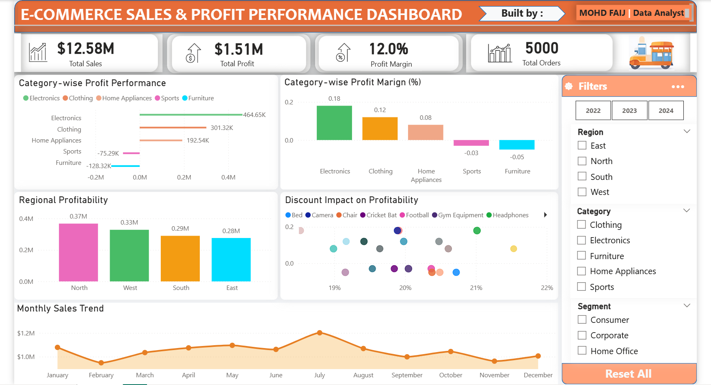

# 📊 E-Commerce Sales & Profit Performance Dashboard



---

## 📌 Project Overview
End-to-end Business Intelligence project analyzing sales performance, profitability drivers, and discount impact in an e-commerce business.

Data was cleaned using Python (Pandas) and transformed into an interactive Power BI dashboard using DAX-driven KPIs.

---

## 🎯 Business Objectives
- Evaluate overall Sales, Profit & Profit Margin
- Identify top and underperforming categories
- Compare regional profitability
- Analyze discount impact on profit
- Track monthly sales trends

---

## 🛠 Tools & Technologies
- Python (Pandas,Numby,Matplotlib)
- Excel
- Power BI
- DAX

---

## 📈 Key Insights
- Electronics generates the highest profit contribution
- Furniture & Sports show negative profit margins
- Profitability varies across regions
- Higher discounts reduce profit margins
- Sales peak mid-year (seasonal trend)

---

## 🧠 DAX Measures (KPI Engine)

```DAX
Total Sales = SUM(Sales[Sales Amount])

Total Profit = SUM(Sales[Profit])

Profit Margin % = 
DIVIDE([Total Profit], [Total Sales], 0)

Total Orders = COUNT(Sales[Order ID])


---

## 📂 Repository Contents

📊 E-commerce_Project.pbix — Power BI dashboard file  
🖼 E-commerce Dashboard.png — Dashboard preview image  
📄 dataset.xlsx — Cleaned dataset  
📘 README.md — Project documentation  

---

## 🚀 Future Enhancements

Planned improvements:

⭐ Customer Segmentation Analysis  
📅 Year-over-Year Growth Analysis  
📈 Advanced KPI Trend Analysis  
⚡ Automated Data Refresh Integration  

---

## 👤 Author

Mohd Faij  
Aspiring Data Analyst | Power BI | Python | Excel  

🔗 GitHub: https://github.com/mohdfaij-data  
🔗 LinkedIn: https://www.linkedin.com/in/mohd-faij ```

